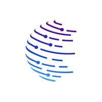

## Hi there, I'm Kamva-Hanisi👋✨

## About Me

I am a Full-Stack Software Engineer, proudly trained and certified through the ALX Software Engineering Program, where I gained extensive hands-on experience in both front-end and back-end development. My passion for software development drives me to continuously learn, build, and refine solutions that are efficient, scalable, and impactful.

In addition to my ALX training, I have expanded my backend expertise through a Udemy certification in:

Learn C# by Doing | C# Projects | Bootcamp for C# Interview | Advanced C# | .NET 9 | LINQ | Interview Questions

This has strengthened my understanding of .NET Core, ASP.NET Core, Entity Framework, and the use of Visual Studio for professional software development.

My GitHub profile reflects this journey — showcasing projects that highlight my technical proficiency, creativity, and commitment to clean, maintainable code. I am currently focused on revamping my repositories to better represent my professional capabilities and readiness for new opportunities.
## 🔧 Technologies & Tools

- **Front-end**: JavaScript, React, HTML, CSS, Redux
- **Back-end**: Node.js, Express, Python, C#, .NET Core, ASP.NET Core
-**Frameworks & Tools**: Entity Framework, Visual Studio, Git, REST APIs, Shell Scripting
-**Databases**: MySQL, SQL
-**Development Practices**: Agile Development, Code Review, Test-Driven Development

## 📝 WORK

- Check my Repos for more 😉
  https://github.com/kamva-hanisi?tab=repositories

## 🌱 I’m currently learning

- **software engineering at ALX (powered by Holberton Inc)-Nairobi, Kenya (ALX HQ)**
- **Udemy (online learning platform)-San Francisco, California, USA (Udemy headquarters)**

## 📫 How to reach me:

- **Email**: lucashanisi@gmail.com
- **LinkedIn**: kamva-hanisi
  
## 👯 Let's Connect

- **I’m looking to collaborate with active and aspiring Software engineers, and feel free to reach out to me**
