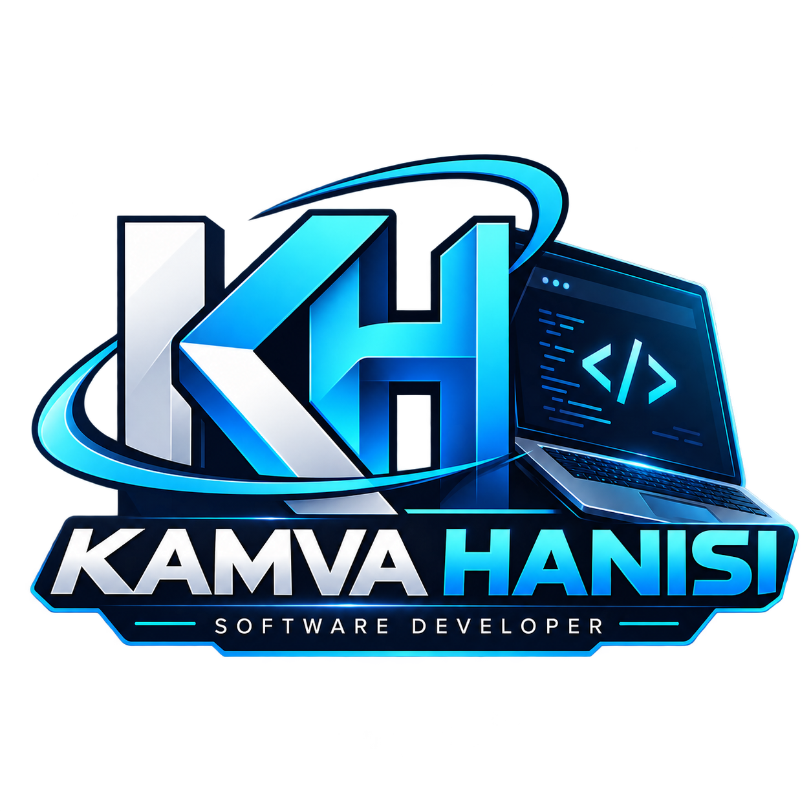
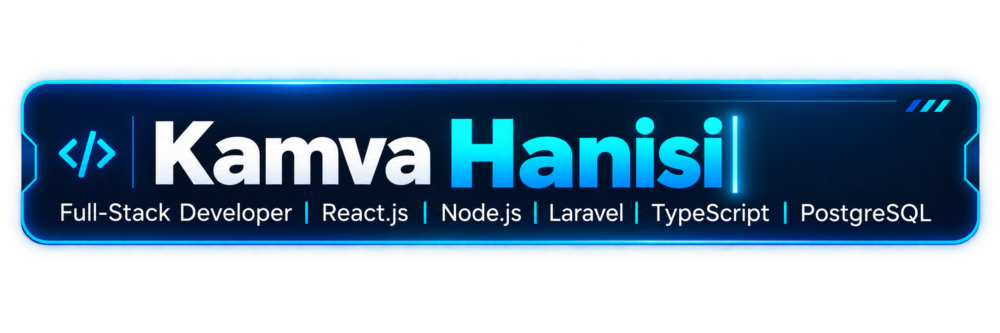
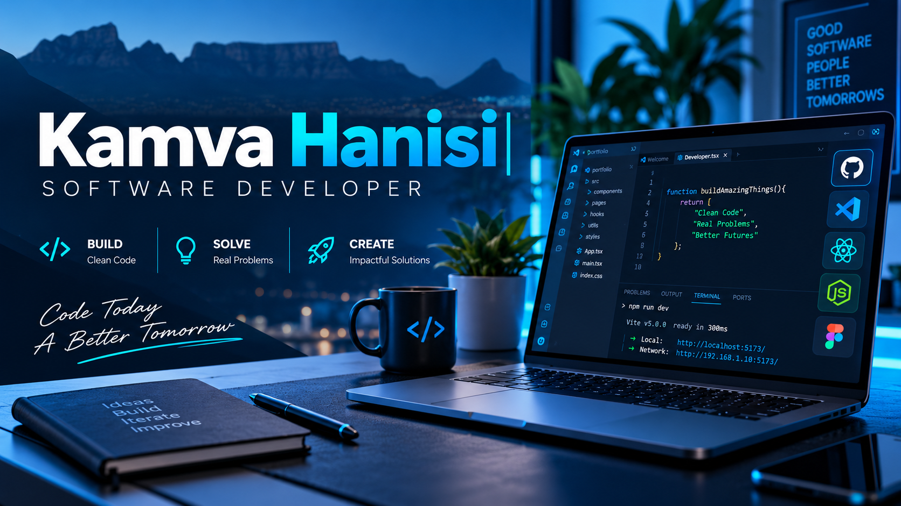
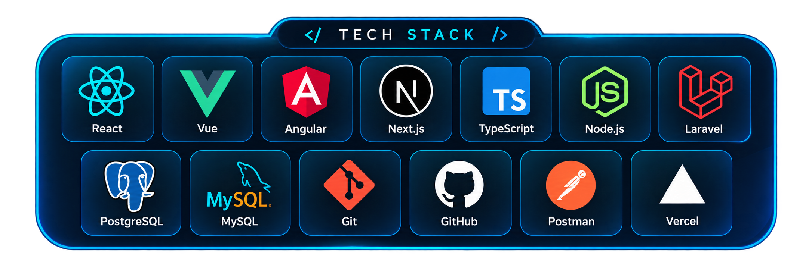
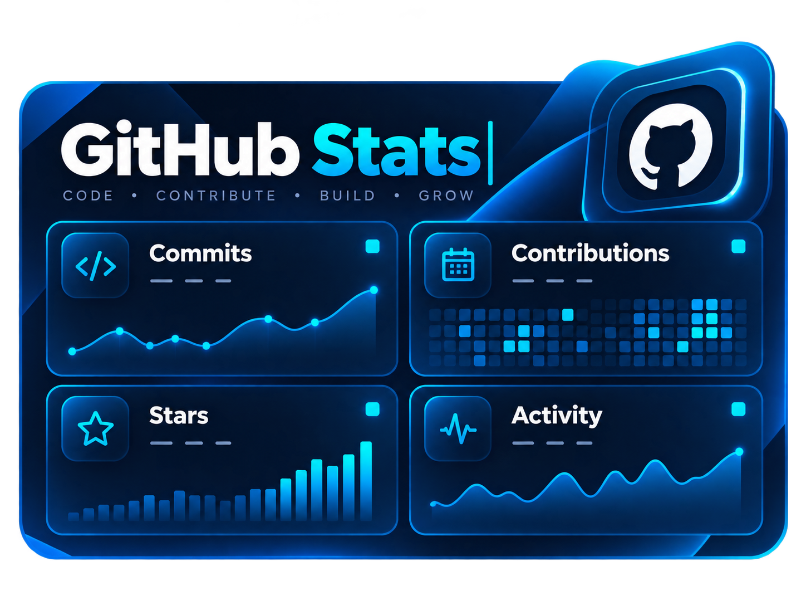
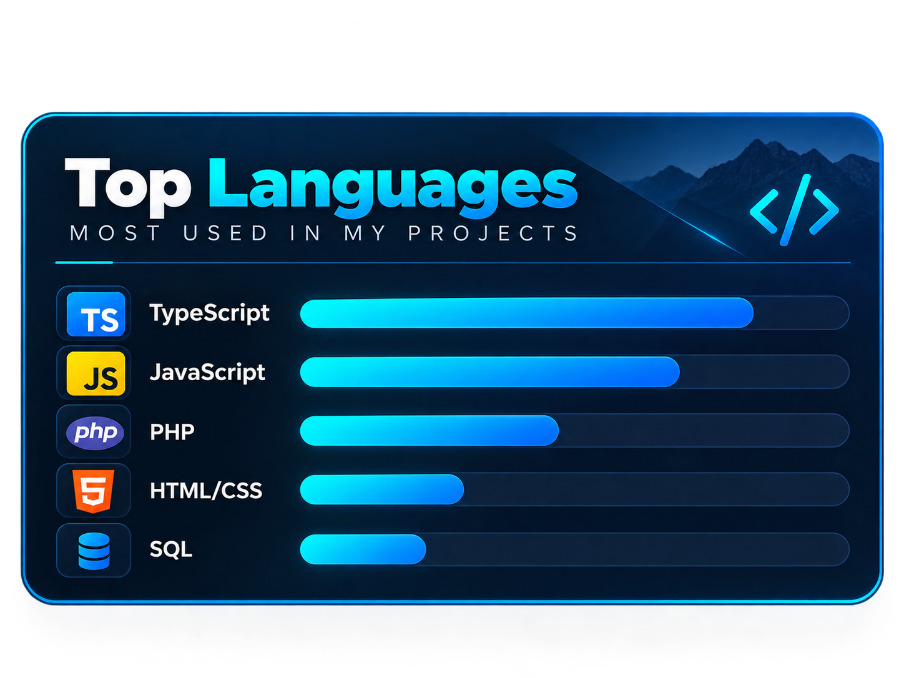
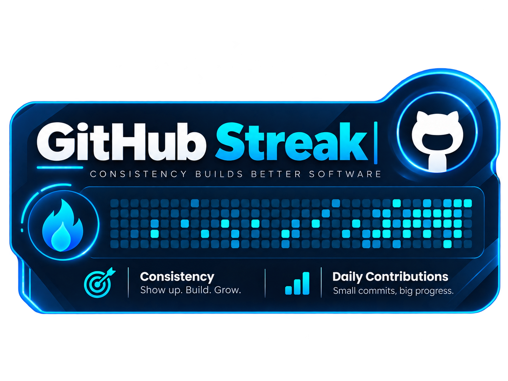

 
 

 
 

✨ About Me
I'm a Full-Stack Developer focused on building clean, scalable, and maintainable web applications across the frontend and backend.
I enjoy taking ideas from UI → API → Database → Deployment, building products with React.js, Vue.js, Angular, Next.js, Node.js, Express.js, TypeScript, PHP, Laravel, PostgreSQL, and MySQL.

const kamva = {
  role: "Full-Stack Developer",
  location: "Johannesburg, South Africa",
  frontend: ["React", "Vue", "Angular", "Next.js", "TypeScript"],
  backend: ["Node.js", "Express.js", "PHP", "Laravel"],
  databases: ["PostgreSQL", "MySQL"],
  interests: [
    "Scalable APIs",
    "Frontend Architecture",
    "Database Design",
    "Testing",
    "Cloud Deployment"
  ]
};
🎯 Developer Snapshot
- 🧩 I enjoy solving real-world problems with practical software.
- ⚡ I build responsive interfaces, REST APIs, authentication flows, dashboards, and database-driven features.
- 🧪 I care about testing, debugging, maintainability, and clean project structure.
- ☁️ I’m growing deeper into CI/CD, cloud deployment, and scalable application architecture.
- 🤝 Open to Full-Stack, Frontend, and Backend Developer opportunities.
🧰 Tech Stack

  

🚀 Featured Projects
💰 Expense Tracker
A full-stack finance application for managing income and expenses through a responsive dashboard with authentication, summaries, filtering, and data visualization.
Tech: React TypeScript Redux Toolkit Tailwind CSS Node.js Express.js PostgreSQL JWT Recharts

🗓️ Employee Leave Management
A full-stack leave management platform with secure authentication, employee management, approval workflows, validation, search, and pagination.
Tech: Laravel 12 PHP Sanctum React MySQL PostgreSQL SASS Vite

💼 Job Application Tracker
A Laravel application for organizing job applications, tracking statuses and interviews, and managing application activity from one dashboard.
Tech: PHP Laravel Blade MySQL JavaScript Pest Vite

✅ Task Manager
A full-stack task management platform with authentication, password reset, protected CRUD operations, REST APIs, and PostgreSQL persistence.
Tech: React JavaScript Node.js Express.js PostgreSQL SASS JWT Neon

🚗 Driving School Management Platform
A full-stack operations and booking platform with separate client and admin experiences, booking flows, tracking, staff tools, and PostgreSQL-backed workflows.
Tech: React Vite SASS Node.js Express.js PostgreSQL JWT Axios

📊 GitHub Dashboard

  

🧠 Top Languages

  

🔥 GitHub Streak

  

🎓 Education
- ALX Africa — Software Engineering Certificate (2023 — 2024)
🤝 Let’s Connect
I’m interested in teams building useful products with clean code, collaboration, mentorship, and practical problem-solving.
Open to: Full-Stack Development • Frontend Development • Backend Development

  

