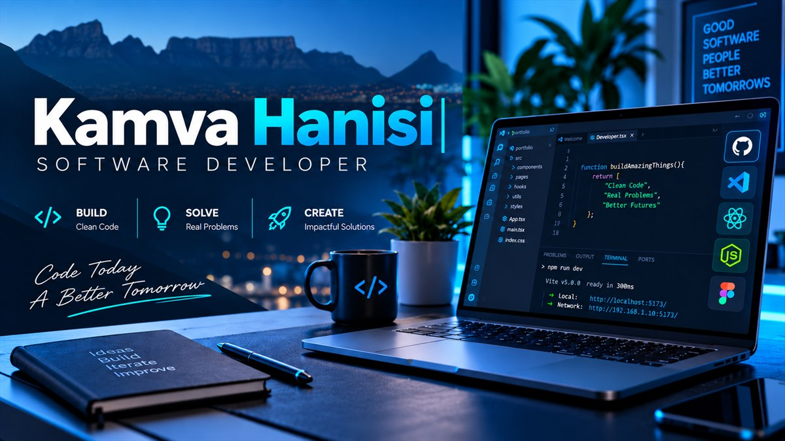

  

  

    📍 Johannesburg, South Africa | Open to local and remote opportunities
  

  

    <a href="#featured-projects">Featured Work</a>
    |
    <a href="https://kamva-hanisi.github.io/Expense-Tracker-App/">Live Project</a>
    |
    <a href="https://github.com/kamva-hanisi?tab=repositories">All Repositories</a>
  

  <strong>🟢 Available for full-stack, frontend, and backend roles</strong>

---

## 👋 About Me

I turn product requirements into responsive interfaces, secure APIs, and well-structured database systems. My projects cover real workflows such as finance tracking, employee leave approvals, job application management, and service bookings.

I care about readable code, dependable user experiences, and software that is straightforward for a team to maintain. I am ready to contribute, learn quickly, and grow alongside an engineering team.

## 💼 What I Bring

| Area | How I Can Contribute |
| --- | --- |
| Product delivery | Build features across the interface, API, database, and deployment flow |
| Frontend | Create responsive UIs, dashboards, reusable components, and predictable state |
| Backend | Develop REST APIs, authentication, validation, and business workflows |
| Data | Design PostgreSQL and MySQL schemas for practical, data-driven features |
| Teamwork | Communicate clearly, debug methodically, document decisions, and welcome feedback |

## 🛠️ Tech Stack

| Frontend | Backend | Database | Tools |
| --- | --- | --- | --- |
| React | Node.js | PostgreSQL | Git |
| Vue | Express.js | MySQL | GitHub |
| Angular | PHP | Neon | Vite |
| Next.js | Laravel |  | Redux Toolkit |
| TypeScript | Sanctum |  | Tailwind CSS |

## 🚀 Featured Projects

| Project | Description | Tools | Links |
| --- | --- | --- | --- |
| **Task Manager** | A full-stack productivity app that helps users create, organize, update, and track tasks. It includes authentication, password recovery, protected task operations, and persistent storage. | React, JavaScript, SASS, Axios, Node.js, Express.js, PostgreSQL, JWT, Neon | [GitHub](https://github.com/kamva-hanisi/Task-Mananger.git) / [Live App](https://kamva-hanisi.github.io/Task-Mananger/) |
| **Expense Tracker App** | A personal finance dashboard for recording income and expenses, reviewing financial summaries, filtering transactions, and visualizing spending data. | React, TypeScript, Redux Toolkit, React Hook Form, Zod, Recharts, Node.js, Express.js, PostgreSQL, JWT | [GitHub](https://github.com/kamva-hanisi/Expense-Tracker-App.git) / [Live App](https://kamva-hanisi.github.io/Expense-Tracker-App/) |
| **Forge & Fade** | A modern full-stack barbershop platform that makes it easy to explore services and book appointments through a responsive customer experience. | React, JavaScript, SASS, Axios, PHP 8, Laravel, Sanctum, MySQL | [GitHub](https://github.com/kamva-hanisi/Forge-And-Fade.git) / [Live App](https://kamva-hanisi.github.io/Forge-And-Fade/) |
| **Driving School App** | An online booking platform that enables students to schedule and manage driving lessons, with dedicated customer and administration experiences. | React, Vite, JavaScript, SASS, Axios, Node.js, Express.js, PostgreSQL, JWT, Neon | [GitHub](https://github.com/kamva-hanisi/driving-school-app.git) / [Live App](https://kamva-hanisi.github.io/driving-school-app/) |

## 🎯 Current Direction

- Building full-stack applications with clear architecture and strong validation.
- Deepening my testing, CI/CD, cloud deployment, and production-readiness skills.
- Looking for opportunities to solve useful problems with a collaborative team.

## 🎓 Education

**ALX Africa** 
Software Engineering Certificate, 2023 - 2024

## 🤝 Let's Connect

I would be glad to hear from companies, recruiters, founders, developers, and potential collaborators. If you are building something useful or looking for a developer who can work across the stack, let us connect.

  <strong>Open to:</strong> Employment | Internships | Freelance Projects | Collaboration
   
   
  <a href="https://github.com/kamva-hanisi">Visit my GitHub profile</a>
  |
  <a href="https://github.com/kamva-hanisi?tab=repositories">Explore my work</a>

